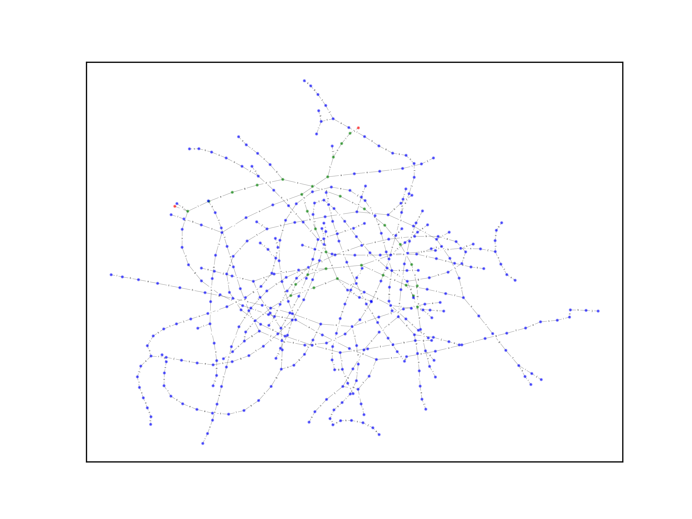

# Hard-300 | Web/Reverse | Shooting Kers

## Информация

> А знаете, звёзды, ведь они такие красивые. Вы когда-нибудь смотрели на небо? Там, в высоте, они сияют — гордые, одинокие, но такие прекрасные. В такой вечер, как этот, хочется просто забыть обо всём, лечь в траву и до самого утра наслаждаться красотой звёздного неба. А хотите узнать, что ещё такое же красивое, как звёзды?
> 
> http://address:33064


## Запуск

```sh
docker-compose up --build -d
```


## Описание

Веб-страничка показывает листинг PHP-опкодов сервера. Сервер принимает GET-параметр `flag`, проверяет его на корректность и печатает результат. Если присмотреться к опкодам, можно заметить повторяющиеся части, каждая из которых проверяет очередной символ флага и делает куда-то прыжок в зависимости от символа. 

Граф прыжков представлен на картинке. Красными выделены состояния начала и конца флага, зелёными — остальные состояния по пути флага (можно открыть картинку и посмотреть на символы, которыми подписаны рёбра переходов).




## Решение

Нужно распарсить страничку с опкодами, достать оттуда граф переходов и найти путь от начальной до конечной вершин. Символы на рёбрах этого пути и будут символами флага.

[Пример эксплоита](exploit.py)


## Флаг

Флаг лежит в файле [service/flag.txt](service/flag.txt).

`flag{shooting_kers_is_beautiful}`
